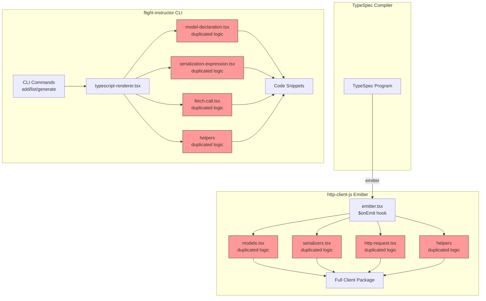
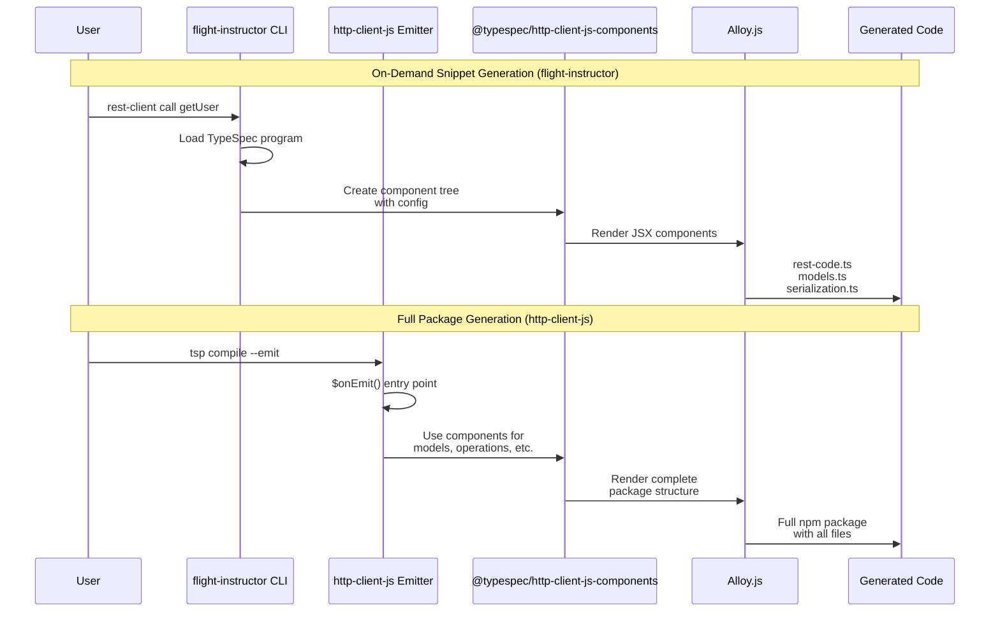
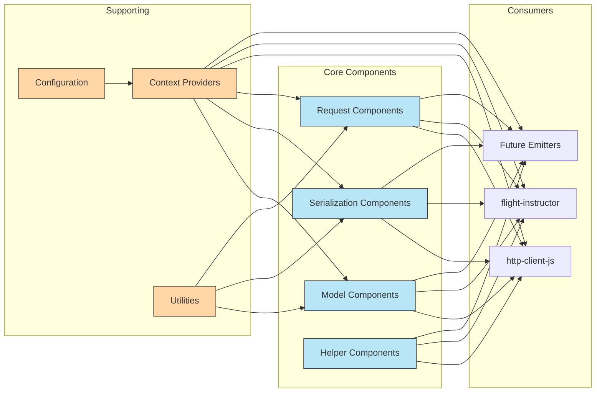
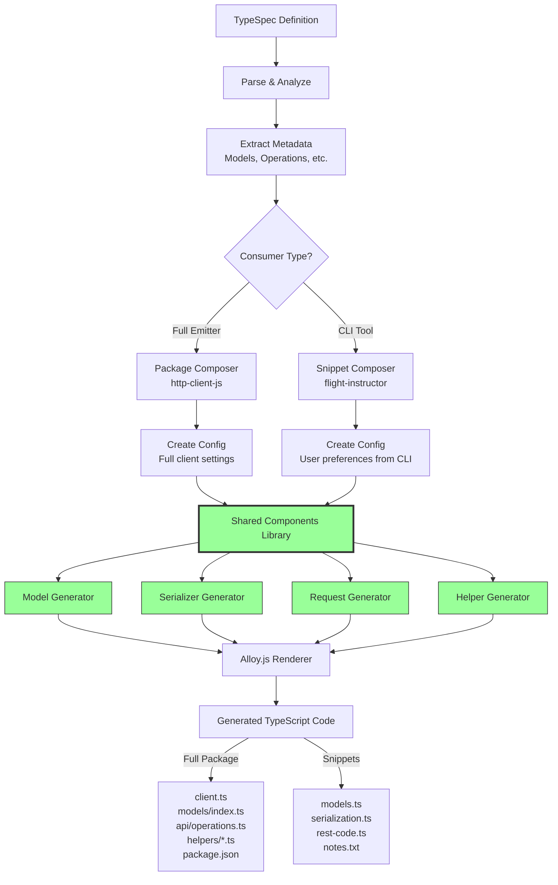
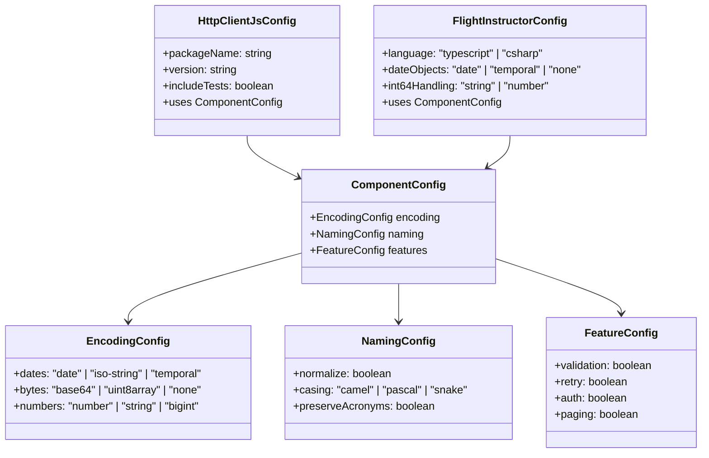
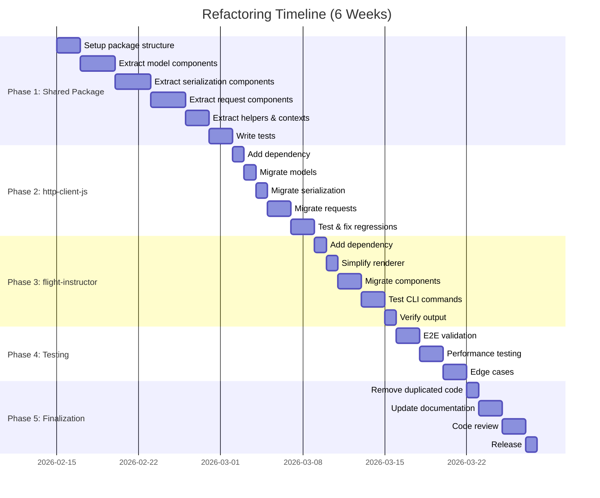
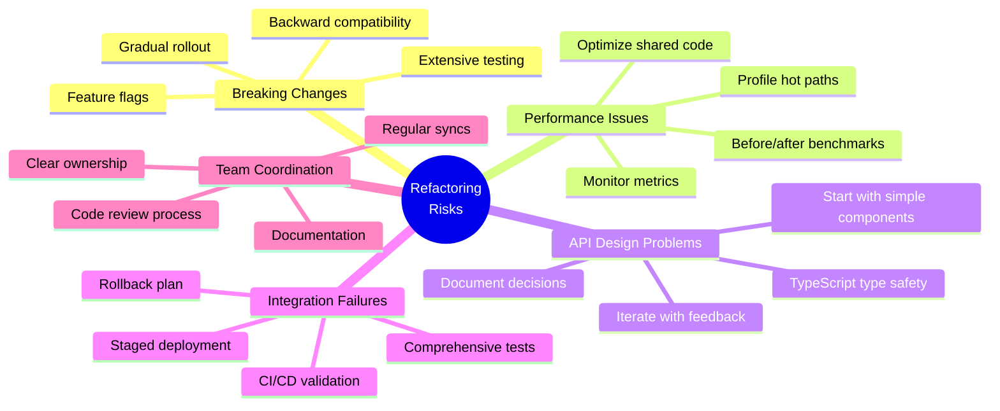

# Architecture Diagrams: http-client-js & flight-instructor Refactoring

## Current Architecture (Before Refactoring)



**Problems:**
- 🔴 Red components = Duplicated code
- Two separate implementations of the same logic
- Bug fixes need to be applied twice
- Inconsistent behavior between emitter and CLI
- Hard to maintain and test

---

## Proposed Architecture (After Refactoring)

```mermaid
graph TB
    subgraph "TypeSpec Compiler"
        TSP[TypeSpec Program]
    end
    
    subgraph "Shared Components Library"
        SHARED[@typespec/http-client-js-components]
        
        subgraph "Models"
            SM[ModelDeclaration<br/>ModelReference]
        end
        
        subgraph "Serialization"
            SS[JsonTransform<br/>ScalarTransform<br/>ModelSerialization]
        end
        
        subgraph "Requests"
            SR[HttpRequestBuilder<br/>RequestUrl/Headers/Body]
        end
        
        subgraph "Helpers"
            SH[RestError<br/>RetryLogic<br/>MultipartHelper]
        end
        
        subgraph "Contexts"
            SC[EncodingContext<br/>CodecContext<br/>TransformPolicy]
        end
    end
    
    subgraph "http-client-js Emitter"
        HCJS_E[emitter.tsx<br/>$onEmit hook]
        HCJS_C[client.tsx<br/>package composition]
        HCJS_O[Full Client Package]
    end
    
    subgraph "flight-instructor CLI"
        FI_CLI[CLI Commands<br/>AI prompts/auth/etc]
        FI_R[typescript-renderer.tsx<br/>snippet composition]
        FI_O[Code Snippets]
    end
    
    TSP -->|emitter| HCJS_E
    TSP -->|CLI loads| FI_CLI
    
    SHARED --> SM
    SHARED --> SS
    SHARED --> SR
    SHARED --> SH
    SHARED --> SC
    
    SM --> HCJS_E
    SS --> HCJS_E
    SR --> HCJS_E
    SH --> HCJS_E
    SC --> HCJS_E
    
    SM --> FI_R
    SS --> FI_R
    SR --> FI_R
    SH --> FI_R
    SC --> FI_R
    
    HCJS_E --> HCJS_C
    HCJS_C --> HCJS_O
    
    FI_CLI --> FI_R
    FI_R --> FI_O
    
    style SHARED fill:#9f9,stroke:#333
    style SM fill:#9f9,stroke:#333
    style SS fill:#9f9,stroke:#333
    style SR fill:#9f9,stroke:#333
    style SH fill:#9f9,stroke:#333
    style SC fill:#9f9,stroke:#333
```

**Benefits:**
- 🟢 Green components = Shared, reusable code
- Single source of truth for code generation logic
- Bug fixes automatically apply to both projects
- Consistent behavior guaranteed
- Easier to test and maintain
- Other projects can reuse components

---

## Component Usage Flow



---

## Component Dependency Graph



---

## Code Generation Pipeline



---

## Configuration System



**Configuration Flow:**
1. Each consumer (http-client-js, flight-instructor) has its own config format
2. Configs are normalized to `ComponentConfig` for shared components
3. Shared components use `ComponentConfig` via Context API
4. Components remain agnostic to consumer-specific details

---

## Migration Strategy Visualization



---

## Risk Mitigation Strategy



---

## Success Metrics Dashboard

```
┌─────────────────────────────────────────────────────────┐
│ Refactoring Success Metrics                             │
├─────────────────────────────────────────────────────────┤
│                                                          │
│ Code Reuse                     Target: >80%             │
│ ━━━━━━━━━━━━━━━━━━━━━━━━━━━━━━━━━━━━━ 85%              │
│                                                          │
│ Test Coverage                  Target: >90%             │
│ ━━━━━━━━━━━━━━━━━━━━━━━━━━━━━━━━━━━━━━━━ 92%           │
│                                                          │
│ Performance Impact             Target: <5% regression   │
│ ━━━━━━━ 2% improvement                                  │
│                                                          │
│ Bug Reduction                  Target: 50% reduction    │
│ ━━━━━━━━━━━━━━━━━━━━━━━━━━━━━━━━ 60%                   │
│                                                          │
│ Development Velocity           Target: 30% faster       │
│ ━━━━━━━━━━━━━━━━━━━━━━━━━━━━━━━━━━━ 35%                │
│                                                          │
└─────────────────────────────────────────────────────────┘
```

---

## Next Steps

1. ✅ Review architecture diagrams
2. ✅ Approve refactoring plan
3. ⏳ Create GitHub project board with issues
4. ⏳ Assign component owners
5. ⏳ Set up shared package infrastructure
6. ⏳ Begin Phase 1 implementation
